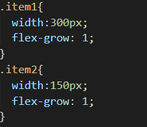

# css中的flex属性
`item`：flex盒子的子元素
## 父容器属性
> flex-direction

**说明**:确定主轴方向
+ row：从左至右横向主轴（默认）
+ column：从上至下纵向主轴
+ row-reverse：横向主轴反向
+ row-column：纵向主轴反向

> justify-content

**说明**:父容器属性，主轴方向
+ space-around：子元素沿主轴分布，两侧距离固定
+ space-evenly：子元素沿主轴分布，相邻距离和两侧距边界距离相等
+ space-between：子元素沿主轴分布，两边贴边界
+ center：全部居中
+ start&flex-start：全部在头部
+ end&flex-end：全部在尾部

> align-items

**说明**:父容器交叉轴属性
+ stretch：默认属性，拉伸，占满父元素高度
+ center：交叉轴居中
+ start&flex-start：交叉轴头部
+ end&flex-end：交叉轴尾部
+ baseline：`item`中文字对齐，不考虑`item`的位置

> flex-warp

**说明**:子容器的换行
+ warp：溢出换行
+ nowarp：不允许换行
+ warp-reverse：上下反向

> flex-flow

**说明**:flex-direction和flex-warp的合并
+ row wrap：两个属性

> align-content

**说明**:多行沿交叉轴对齐方式，理解为纵向的justify-content
+ stretch：拉伸，多行充满父元素

## 子容器属性

> align-self

**说明**:子容器属性

+ stretch：默认属性，拉伸，占满父元素高度
+ start&flex-start：交叉轴头部
+ end&flex-end：交叉轴尾部
+ baseline：`item`中文字对齐，不考虑`item`的位置

> flex-grow

**说明**:子容器伸展因子
+ 1:两个子容器都为1，表示容器一占用盒子剩余空间的1/2

> flex-shrink

**说明**:子容器压缩因子，
+ 1:两个子容器都为1，表示两个子容器缩小的像素数量相同以填满盒子

> flex-basis
+ 100px
**说明**:主轴方向覆盖原有的尺寸，主轴为横向就回覆盖宽度，纵向会覆盖高度

> order

+ 0 设置子容器的显示顺序，每个子容器都得设置。
