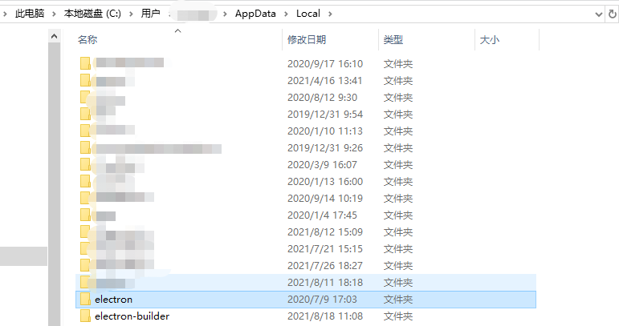
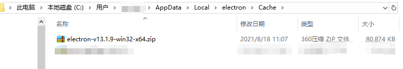
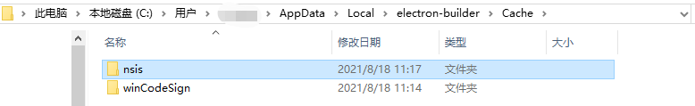
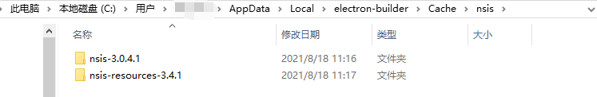

## electron init vue
> vue add electron-builder 安装electron-builder依赖
1. 更行package.json中的脚本文件，添加main:background.js
2. src目录下增加background.js文件
3. 期间会新增选择electron的版本
4. 运行npm run electron:serve 构建项目，可以实时编译
9. 运行npm run electron:build

> 错误总结
1. 可能出现node版本过低问题，windows直接官网下载nodejs安装到软件安装路径中覆盖之前的文件
2. `Get"https://github.com/electron/electron/releases/download/v13.1.9/electron-v13.1.9-win32-x64.zip": read tcp 192.168.3.10:65128->20.205.243.166:443: wsarecv: A connection attempt failed because the connected party did not properly respond after a period of time, or established connection failed because connected host has failed to respond.`

    连接不到github 可将electron-v13.1.9-win32-x64.zip安装包自行下载后放在目录C:\Users\${name}\AppData\Local\electron\Cache中
然后也会下载其他例如nsis、winCodeSign-2.6.0.7z等文件，可以自行下载成功，附上下载后的文件目录

3. 打包后出现请求路径为app://协议问题


4. 找不到require，在vue.config.js中添加
```json
pluginOptions: {
  electronBuilder: {
    nodeIntegration:true, √
  }
}

// background.js
webPreferences: {
  // 跨域
  webSecurity: false,
  enableRemoteModule: !!process.env.IS_TEST,
  nodeIntegration: true, √
  contextIsolation: false √
}
```


[AppData/local目录](none)

[AppData/local/electron/cache目录](none)

[AppData/local/electron-build/cache目录](none)

[AppData/local/electron-build/cache/nsis目录](none)

[AppData/local/electron-build/cache/winCodeSign目录](none)

> 主进程：background.js


[参考](https://www.bookstack.cn/read/David1025-electron-vue-in-action/a07b4253fe1f86c5.md)