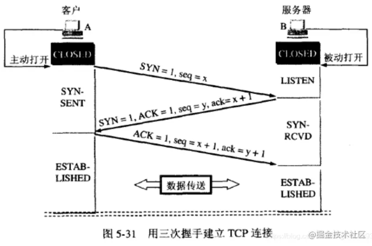
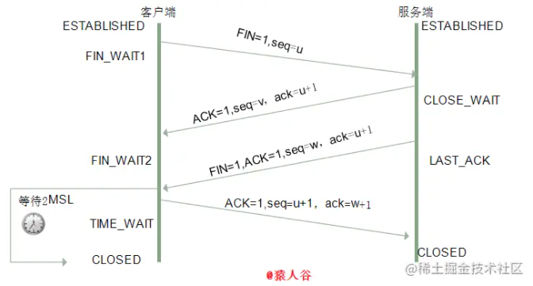

# http不同版本的特点
### HTTP/0.9

+ 只有一个命令GET
+ 没有header（请求头和响应头）等描述数据的信息
+ 服务器发送完毕，就关闭TCP连接

### HTTP/1.0

+ 增加了很多命令，例如POST、PUT等
+ 增加status code（状态码）和header（请求头和响应头）
+ 多字符集支持、多部分发送、权限、缓存等

### HTTP/1.1

+ 持久连接
+ pipeline
+ 增加host和其他一些命令

### HTTP/2.0

+ 所有数据以二进制传输（http1.1中大部分数据是以字符串传输）
+ 同一个连接里面发送多个请求不再需要按照顺序来
+ 头信息压缩以及推送等提高效率的功能

## 区别
### 1.0与1.1
1. **连接**：1.0非持久连接；1.1为持久连接，使用持久连接让多个http请求复用同一个TCP连接。
1. **资源请求**：1.0不支持断点续传，不支持获取资源的某一部分；1.1在请求头引入range可以截取资源的某一部分；
1. **缓存**：1.0使用header中If-Modified-Since、Expires判断缓存标准，1.1中引入更多缓存头['Etag','If-Unmodified-Since','If-Match','If-None-Match']
1. **主机名**：1.0没有host地址的头，默认指定的IP就是主机；1.1考虑到主机为虚拟主机的情况，可能IP是相同的
1. **请求方式**：1.1新增了PUT，HEAD，OPTIONS请求方式


### 1.1与2.0
1. **二进制**：1.1中报文头是`文本`，消息体是`文本/二进制`；2.0中都是二进制，统一称为“帧”，
1. **多路复用**：2.0复用TCP连接，但是在一个连接里，客户端和服务器都可以发送多个请求或回应，并且没有顺序
1. **数据流**：因为没有顺序，所以必须对每个数据包做标记，每个数据包有标记表示属于哪个数据流
1. **头信息压缩**：头信息使用gzip/compress压缩后发送，并且服务端与客户端都会维护一张头信息表，就不用发送重复的字段了
1. **服务器推送**：服务端主动推送给客户端，推送的是`静态资源`


## TCP标志位
1. SYN(synchronous建立连接)；

1. ACK(acknowledgement 确认)

1. PSH(push传送)

1. FIN(finish结束)

1. RST(reset重置)

1. URG(urgent紧急)

1. sequence number顺序号码

1. acknowledge number确认号码

## 三次握手
### 握手流程

1. **第一次**：客户端发送`SYN=1 + seq number = 123(随机生成)`，服务端识别为建立连接请求
1. **第二次**：服务端收到连接请求后，发送`ACK=1+SYN=1+ack number=124(seq number+1)+seq number=789(随机生成)`表示同意连接
1. **第三次**：客户端检查ack number是否为自己发送的seqnumber+1，ACK是否为1，正确后发送`acknumber=seqnumber(服务器生成的)+1`




### 半连接队列
`客户端在发送连接请求后处于等待状态，在服务器响应之前的这段时间就叫做半连接队列，三次握手完成建立连接后称为全连接队列`

**请求间隔时间**：未响应的请求重发时间间隔为指数增长，类似于1s，2s，4s，8s

### 三次握手中是否可以携带数据

```txt
只有第三次可以携带数据，因为此时在客户端看来客户端与服务端的接收和发送都已经经过测试，可以进行交互
```

### SYN攻击
`伪造的客户端，不响应第三次握手，长时间占据服务器资源，可能导致服务器无法处理正常的请求`
**防御办法**
1. 缩短超时（SYN Timeout）时间
1. 增加最大半连接数
1. 过滤网关防护
1. SYN cookies技术


## 四次挥手
### 挥手流程
1. **第一次**：客户端发送FIN=1，seq=num1（某一序列号），关闭连接，进入FIN_WAIT1等待态
2. **第二次**：服务端发送ACK=1，ack=num1+1，seq=num2，进入CLOSE_WAIT态，客户端收到后处于FIN_WAIT2态
3. **第三次**：服务端也可以断开了，发送FIN=1，ACK=1，seq=num3，确认号ack=num1+1，进入LAST_ACK最后确认状态
4. **第四次**：客户端收到FIN后发送ACK=1，seq=num1+1，ack=num3+1，客户端进入TIME_WAIT（时间等待）状态。

`此时TCP未释放掉，需要经过时间等待计时器设置的时间2MSL后，客户端才进入CLOSED状态，等待2MLS（两倍报文生存的最大时间）的意义是防止客户端ACK报文发送失败`



### 为什么四次
```txt
在建立连接时，服务端响应客户端连接请求时可以一次发送连接报文SYN和确认报文ACK，因为不需要等待连接当前的状态完成，但在关闭时，socket连接很可能还在发送数据，所以将ACK报文与FIN分开，socket完成后才发送FIN
```
