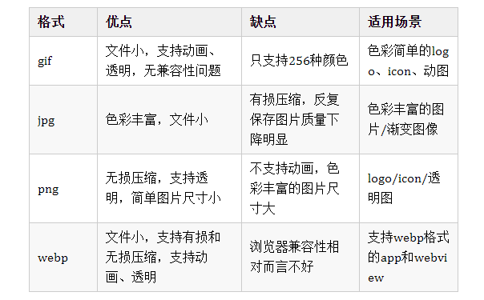

## 图片格式优缺点

## 色度
8位色，每个像素所能显示的彩色数为2的8次方，即256种颜色。

16位增强色，16位彩色，每个像素所能显示的彩色数为2的16次方，即65536种颜色。

24位真彩色[1]，每个像素所能显示的彩色数为24位，即2的24次方，约1680万种颜色。

32位真彩色，即在24位真彩色图像的基础上再增加一个表示图像透明度信息的Alpha通道。

32位真彩色并非是2的32次方的色数，它其实也是1677万多色，不过它增加了256阶颜色的灰度,为了方便称呼，就规定它为32位色