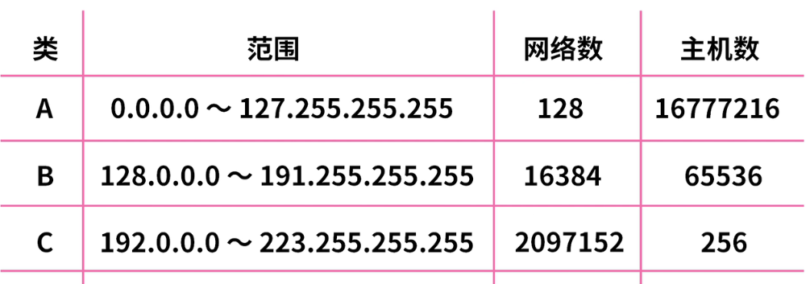
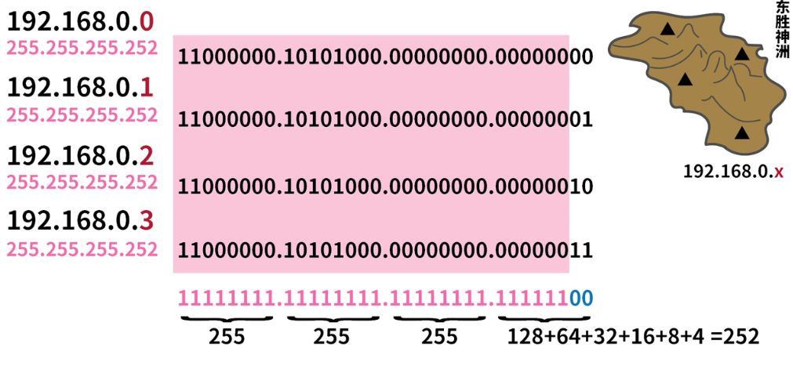

# 计算机基础类
## 0.1 加 0.2 为什么不能与 0.3，而等于 0.30000000000000004
```
  计算机计算时，会将十进制数转化为二进制数进行计算，然后再将二进制计算的结果转化为十进制返回

  IEEE754标准规定浮点数数量上限为小数点后5
  第一位为符号位
  2-12位为指数位
  13-64位为小数位，一共52位

  小数转换为二进制
  整数部分除以二，逆序取余，小数部分乘以二，顺序取整
```


### 运算过程
  1. 0.1 在二进制中变成了无限循环小数，0.2 也是。
  2. 转化为指数形式，并且小数点后保留 52 位
  3. 采用四舍五入标准，当第 53 位为零时，舍弃保留 52 位，当第 53 位为 1 时进位，当第 52 位为 0 时，进位为 1，当第 52 位为 1 时，后两位则变成 10
  4. 调整为相同的指数，相同的位数相加，1+0=1,0+0=0,1+1=10
  5. 将和的指数化为0
  6. 最后转化为十进制数，由于保留小数点后 52 位可能会导致不可预测的误差


## 子网掩码
+ IPv4是由4组8位的二进制数字组成的
+ 所以每一组的范围都是0-255
+ ip地址由网络号和主机号组成
+ ABC类地址对应的网络号与主机号的分割方式不同

+ 一个C类地址最多可以表示256台主机，但当所要标记的主机很少时，会出现很多冗余
+ 当所要标记的主机IP转换为2进制，当前很多位一样时，同一用1代替，最后转化为10进制，所得十进制IP地址便是此区域的子网掩码

+ 另一种表示方法，192.168.0.0/X，X 表示子网掩码中 1 的数量