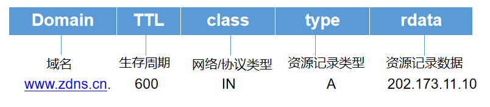
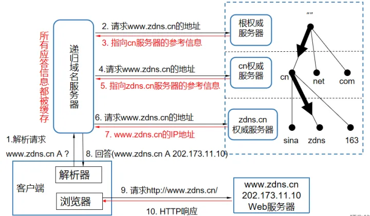

# DNS (domain name system)域名系统

## 解析流程

1. 输入域名，查找本地服务器缓存，缓存格式如下，缓存查不到继续下一步
   

- TTL：失效时间
- class：网络协议类型，目前只有互联网，所以永远是 IN（internet）
- type：资源记录类型，IPV4（A）、IPV6（AAAA）等

## 查询方式，服务器协同方式

1. 域名结构
   
2. 解析流程
   
   本地运营商 DNS 服务器（Local DNS Server），如果没有则去根服务器（Root DNS Server），根服务器找到顶级域名的服务器，顶级域名服务器查询二级域名，同理一直查询到对应域名并缓存结果

## DNS 客户端与服务器交互细节

1. getHostByName

    在操作系统的引用库中，使用 getHostByName 方法发送请求到 DNS 服务器
