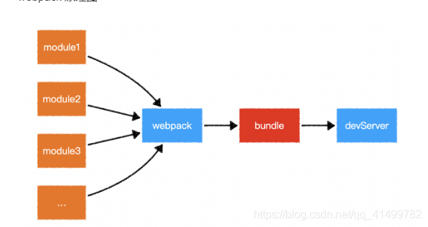
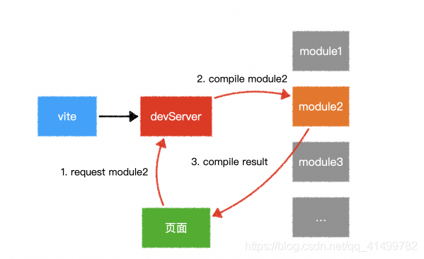

## <center>vite</center>

1. index.html
  ```html
    <!-- 使用浏览器支持的原生模块
         vite高度依赖浏览器打包模块
    -->
    <script type="module"></script>
  ```
*所有组件单独请求引入，先转化为virtual Dom再引入*

1. webpack图示


1. vite图示


<p style="text-indent:2em;line-height:30px;">webpack会先打包，然后启动开发服务器，请求服务器时直接给予打包结果。</p>
<p style="text-indent:2em;line-height:30px;">vite是直接启动开发服务器，请求哪个模块再对该模块进行实时编译。</p>
<p style="text-indent:2em;line-height:30px;">由于现代浏览器本身就支持ES Module，会自动向依赖的Module发出请求。vite充分利用这一点，将开发环境下的模块文件，就作为浏览器要执行的文件，而不是像webpack那样进行打包合并。</p>
<p style="text-indent:2em;line-height:30px;">由于vite在启动的时候不需要打包，也就意味着不需要分析模块的依赖、不需要编译，因此启动速度非常快。当浏览器请求某个模块时，再根据需要对模块内容进行编译。这种按需动态编译的方式，极大的缩减了编译时间，项目越复杂、模块越多，vite的优势越明显。</p>
<p style="text-indent:2em;line-height:30px;">在HMR（热更新）方面，当改动了一个模块后，仅需让浏览器重新请求该模块即可，不像webpack那样需要把该模块的相关依赖模块全部编译一次，效率更高。</p>
<p style="text-indent:2em;line-height:30px;">当需要打包到生产环境时，vite使用传统的rollup（也可以自己手动安装webpack来）进行打包，因此，vite的主要优势在开发阶段。另外，由于vite利用的是ES Module，因此在代码中（除了vite.config.js里面，这里是node的执行环境）不可以使用CommonJS</p>