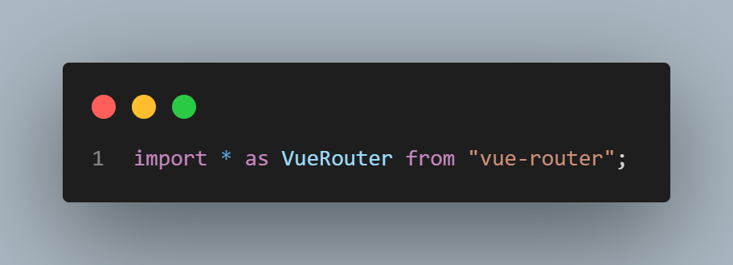
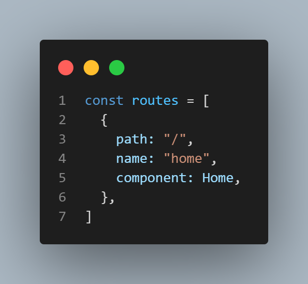

# vue3+vite 构建项目踩坑总结

> 脚手架安装

```
  npm init vite@latest
```

- 选择 vue+javascript，默认是 Vue3
- npm install 安装依赖
- npm run dev 运行项目

> 安装 vue-router

1. npm install vue-router@3.5.1
2. 新建 router 文件夹
3. router 下新建 index.js
4. 直接引入 vue-router，VueRouter 会报错，所以使用 as
   
5. 定义路由的数组
    
6. 创建路由对象，vueRouter不是一个构造器，必须使用createRouter方法
    
7. main.js引入使用
```js
// 支持链式调用
createApp(App).use(router).use(ElementUI).mount("#app");
```
